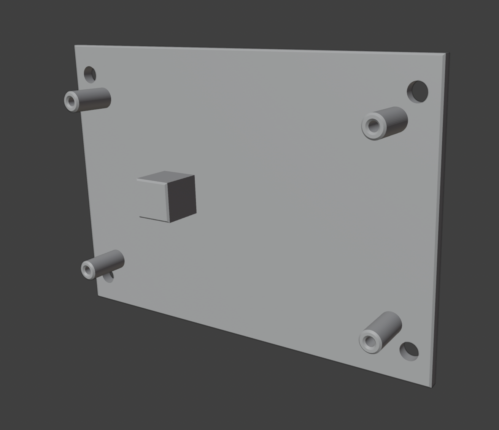

# bitaxe-cooling

This is a project for passiv cooling of a dual BitAxe Gamma setup. The idea is to remove the heatsink and mount both Gammas upside down to the cooling fins of the casing.

## thanks

Big thanks to Mecanix from the [OSMU discord](https://discord.com/servers/open-source-miners-united-1091348375301013615) for his insight on thermal physics.
